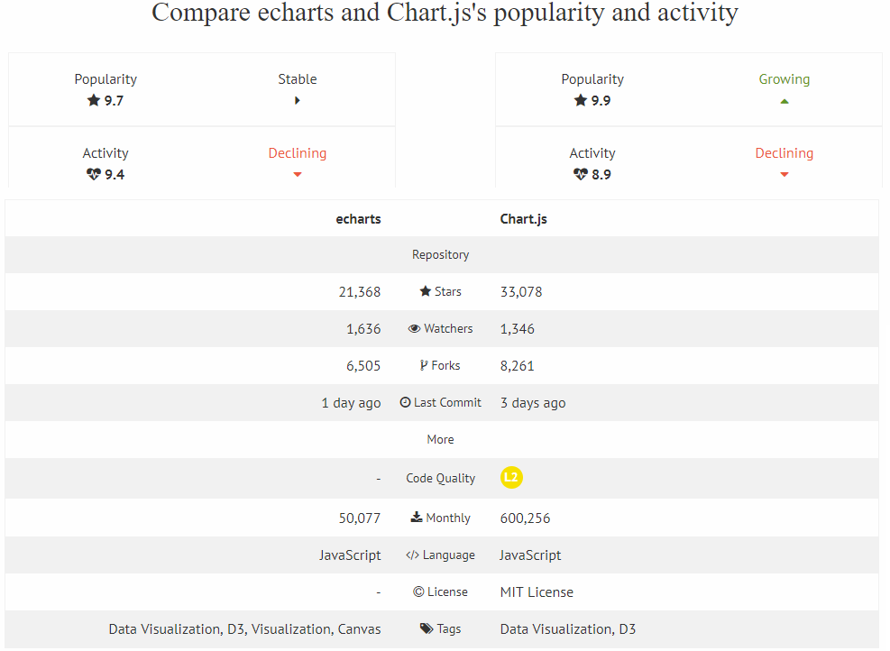
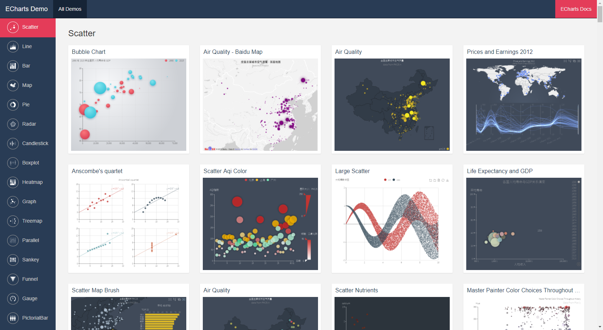
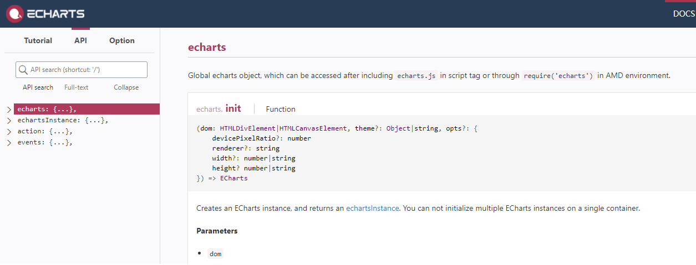
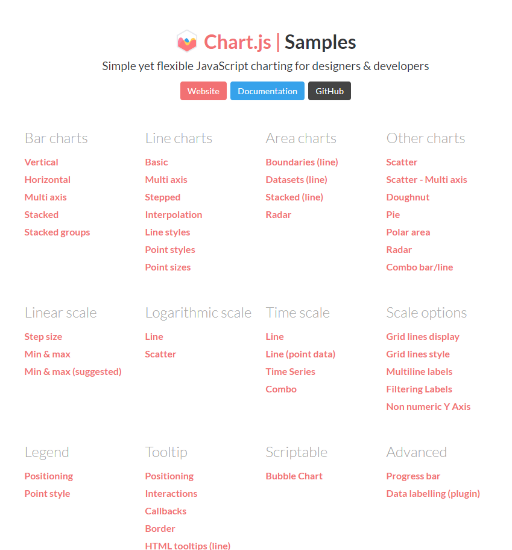
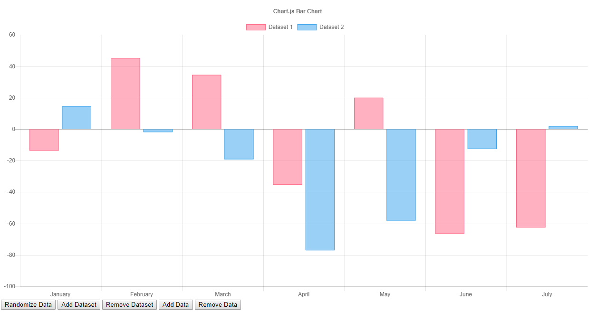
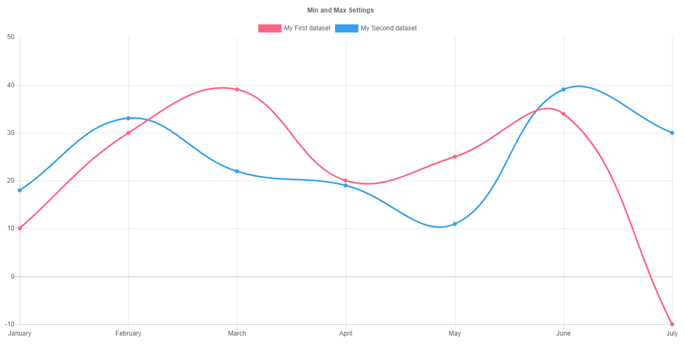
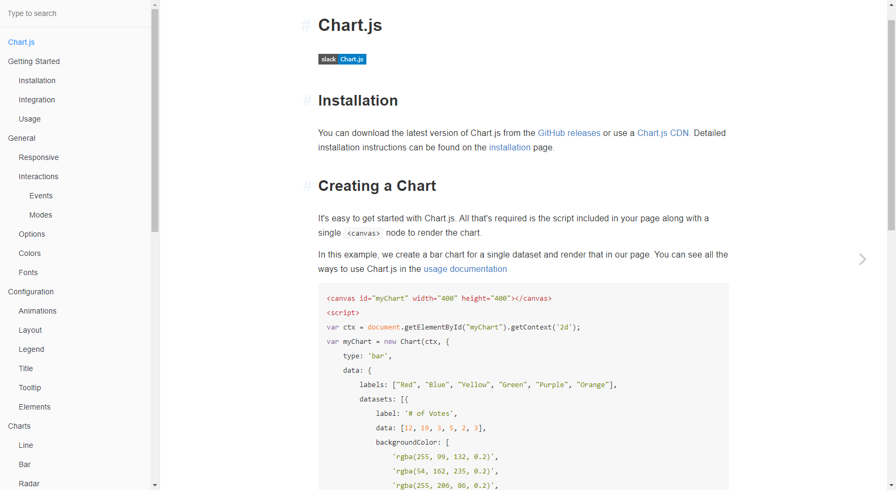

# Chart.js vs Echarts3

## Similarities

- both using canvas
- enough types of charts to fulfill feature requirements
- both not encapsulated as React component
- Not much room for customization

## Repository Comparison

## Demos and API Documentation

[Echarts Demo](https://ecomfe.github.io/echarts-examples/public/index.html)

[Echarts Documentation](https://ecomfe.github.io/echarts-doc/public/en/api.html#echarts)

[Chart.js Demo](http://www.chartjs.org/samples/latest/)

| Echarts                    | Chartjs                                  |
| -------------------------- | ---------------------------------------- |
| Less clear documentation   | Clear documentation                      |
| Clear and detailed demo    | Simple demo                              |
| Ability to handle big data | Not seen comment about handling big data |
| BSD 3-Clause License       | MIT License                              |

Suggestion:

We can combine the use of D3.js with the canvas solution because SVGs from D3.js are good for heavy user interaction components. 

Also Check out [VICTORY](https://formidable.com/open-source/victory/gallery) by formidable (MIT), it is a chart library designed for React. 